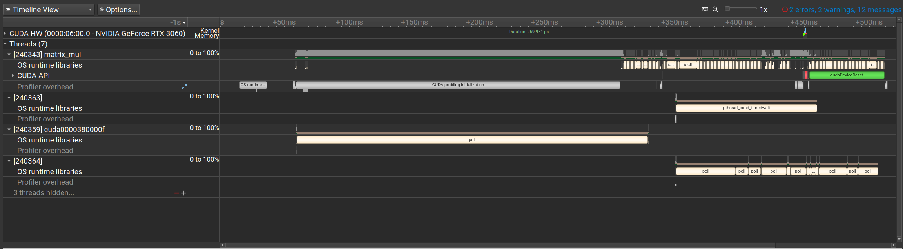

# CUDA实验

本实验通过多个CUDA示例从入门到性能分析，带领读者体验GPU并行编程的开发流程和实践思路。

## 编译运行测试程序

在本节中，我们将使用矩阵乘法示例，比对CPU与GPU的执行效率，并直观感受CUDA加速的优势。

### CMakeLists.txt

以下CMake文件定义了CUDA主机编译器、目标架构及运行时链接选项，确保项目可以正确构建并调用GPU：

```cpp
cmake_minimum_required(VERSION 3.28)

set(CMAKE_EXPORT_COMPILE_COMMANDS ON)
set(CMAKE_CUDA_HOST_COMPILER "/usr/bin/g++")
set(CMAKE_CUDA_FLAGS "${CMAKE_CUDA_FLAGS} -allow-unsupported-compiler")

set(CMAKE_CUDA_ARCHITECTURES 86)

project(MatrixMultiplication LANGUAGES CXX CUDA)

find_package(CUDAToolkit REQUIRED)

add_executable(matrix_mul test.cu)
target_link_libraries(matrix_mul PRIVATE CUDA::cudart)
```

并使用如下脚本编译：

```bash
#!/usr/bin/zsh
rm -rf build/
mkdir build && cd build
cmake ..
make -j$(nproc)
```

编译过程简洁高效，一条命令即可完成整个项目的构建。

### 运行结果

编译完成后，运行示例程序并输出如下结果：
```txt
➜  test git:(v1) ✗ build/matrix_mul
CUDA use time(s): 0.134537
================================================
C[1023,511] is right
```

从输出中可以看出，GPU在处理大规模矩阵运算时展现了明显的性能提升。

## Profile程序

使用nsight-sys进行性能剖析，可以生成火焰图并量化不同阶段的开销，帮助我们发现瓶颈并进行针对性优化。

性能分析如下：

火焰图直观展示了CPU与GPU的执行热点分布，利于后续的内存和计算优化。

## 向量加程序

本示例通过在内核中使用位运算替代分支判断，演示如何编写高效的CUDA向量加实现。

### 向量加程序 CMakeLists.txt

配置与前文类似，此处生成名为TestProgram的可执行文件，并链接CUDA运行时。

```cpp
cmake_minimum_required(VERSION 3.28)

set(CMAKE_EXPORT_COMPILE_COMMANDS ON)
set(CMAKE_CUDA_HOST_COMPILER "/usr/bin/g++")
set(CMAKE_CUDA_FLAGS "${CMAKE_CUDA_FLAGS} -allow-unsupported-compiler")

set(CMAKE_CUDA_ARCHITECTURES 86)

project(MatrixMultiplication LANGUAGES CXX CUDA)

find_package(CUDAToolkit REQUIRED)

add_executable(TestProgram src/main.cu)
target_link_libraries(TestProgram PRIVATE CUDA::cudart)
```

### 主程序代码

程序首先在CPU端执行一次向量加运算，然后在GPU端执行相同计算，并记录两者运行时间。

```cpp
#include <stdio.h>
#include <stdlib.h>
#include <cuda_runtime.h>
#include <time.h>
#include <cstdlib>

// 数组大小
#define N 10000

// CUDA 错误检查宏
#define CUDA_CHECK(call) \
    do { \
        cudaError_t err = call; \
        if(err != cudaSuccess) { \
            fprintf(stderr, "CUDA Error at %s:%d - %s\n", __FILE__, __LINE__, cudaGetErrorString(err)); \
            exit(EXIT_FAILURE); \
        } \
    } while(0)

// CUDA Kernel：计算 C[i] = A[i] + B[i]（当 i 为偶数），否则 C[i] = A[i]
__global__ void compute_kernel(const float* A, const float* B, float* C, int n) {
    int i = blockIdx.x * blockDim.x + threadIdx.x;
    if(i < n) {
        // 使用位运算避免 if 判断
        int is_even = 1 - (i & 1); // i & 1 为 1 表示奇数，0 表示偶数
        C[i] = A[i] + is_even * B[i];
    }
}

// CPU 实现
void compute_cpu(const float* A, const float* B, float* C, int n) {
    for(int i = 0; i < n; ++i) {
        C[i] = (i % 2 == 0) ? (A[i] + B[i]) : A[i];
    }
}

// 将数组写入文件
void write_to_file(const char* filename, const float* data, int n) {
    FILE* fp = fopen(filename, "w");
    if(!fp) {
        perror("Failed to open file");
        exit(EXIT_FAILURE);
    }
    for(int i = 0; i < n; ++i) {
        fprintf(fp, "%f\n", data[i]);
    }
    fclose(fp);
}

int main() {
    float *h_A, *h_B, *h_C_cpu, *h_C_gpu;
    float *d_A, *d_B, *d_C;

    size_t size = N * sizeof(float);

    // 分配主机内存malloc
    h_A = (float*)std::malloc(size);
    h_B = (float*)std::malloc(size);
    h_C_cpu = (float*)std::malloc(size);
    h_C_gpu = (float*)std::malloc(size);

    // 初始化随机数种子
    srand((unsigned int)time(NULL));
    for(int i = 0; i < N; ++i) {
        h_A[i] = (float)(rand()) / RAND_MAX;
        h_B[i] = (float)(rand()) / RAND_MAX;
    }

    // CPU 计算
    clock_t start_cpu = clock();
    compute_cpu(h_A, h_B, h_C_cpu, N);
    clock_t end_cpu = clock();
    double time_cpu = (double)(end_cpu - start_cpu) / CLOCKS_PER_SEC;
    printf("CPU computation time: %f seconds\n", time_cpu);

    // 分配设备内存
    CUDA_CHECK(cudaMalloc((void**)&d_A, size));
    CUDA_CHECK(cudaMalloc((void**)&d_B, size));
    CUDA_CHECK(cudaMalloc((void**)&d_C, size));

    // 复制数据到设备
    CUDA_CHECK(cudaMemcpy(d_A, h_A, size, cudaMemcpyHostToDevice));
    CUDA_CHECK(cudaMemcpy(d_B, h_B, size, cudaMemcpyHostToDevice));

    // GPU 计算
    int threadsPerBlock = 256;
    int blocksPerGrid = (N + threadsPerBlock - 1) / threadsPerBlock;

    cudaEvent_t start_gpu, end_gpu;
    CUDA_CHECK(cudaEventCreate(&start_gpu));
    CUDA_CHECK(cudaEventCreate(&end_gpu));
    CUDA_CHECK(cudaEventRecord(start_gpu, 0));

    compute_kernel<<<blocksPerGrid, threadsPerBlock>>>(d_A, d_B, d_C, N);
    CUDA_CHECK(cudaGetLastError());

    CUDA_CHECK(cudaEventRecord(end_gpu, 0));
    CUDA_CHECK(cudaEventSynchronize(end_gpu));

    float time_gpu = 0;
    CUDA_CHECK(cudaEventElapsedTime(&time_gpu, start_gpu, end_gpu));
    printf("GPU computation time: %f milliseconds\n", time_gpu);

    // 复制结果回主机
    CUDA_CHECK(cudaMemcpy(h_C_gpu, d_C, size, cudaMemcpyDeviceToHost));

    // 将结果写入文件
    write_to_file("result.txt", h_C_gpu, N);

    // 验证结果
    int errors = 0;
    for(int i = 0; i < N; ++i) {
        if(fabs(h_C_cpu[i] - h_C_gpu[i]) > 1e-5) {
            errors++;
            if(errors <= 10) {
                printf("Mismatch at index %d: CPU=%f, GPU=%f\n", i, h_C_cpu[i], h_C_gpu[i]);
            }
        }
    }
    if(errors == 0) {
        printf("Results match.\n");
    } else {
        printf("Total mismatches: %d\n", errors);
    }

    // 释放资源
    std::free(h_A);
    std::free(h_B);
    std::free(h_C_cpu);
    std::free(h_C_gpu);
    CUDA_CHECK(cudaFree(d_A));
    CUDA_CHECK(cudaFree(d_B));
    CUDA_CHECK(cudaFree(d_C));
    CUDA_CHECK(cudaEventDestroy(start_gpu));
    CUDA_CHECK(cudaEventDestroy(end_gpu));

    return 0;
}
```

### 向量加运行结果

示例执行输出如下：

```txt
CPU computation time: 0.000024 seconds
GPU computation time: 0.104256 milliseconds
Results match.
```

整体来看，尽管GPU启动存在开销，但在大规模数据并行处理时依然能获得显著加速，相比CPU展现出更高的效率。

通过本次实验，读者应能掌握CUDA程序的基本结构、编译运行流程及性能分析方法，为后续深入学习GPU编程奠定基础。